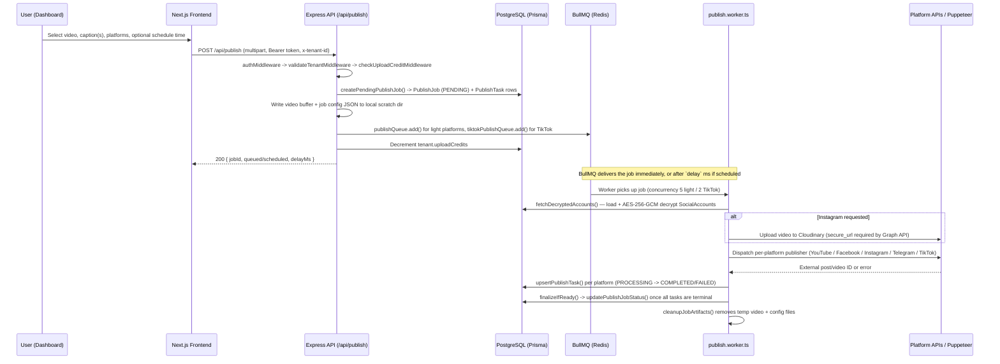
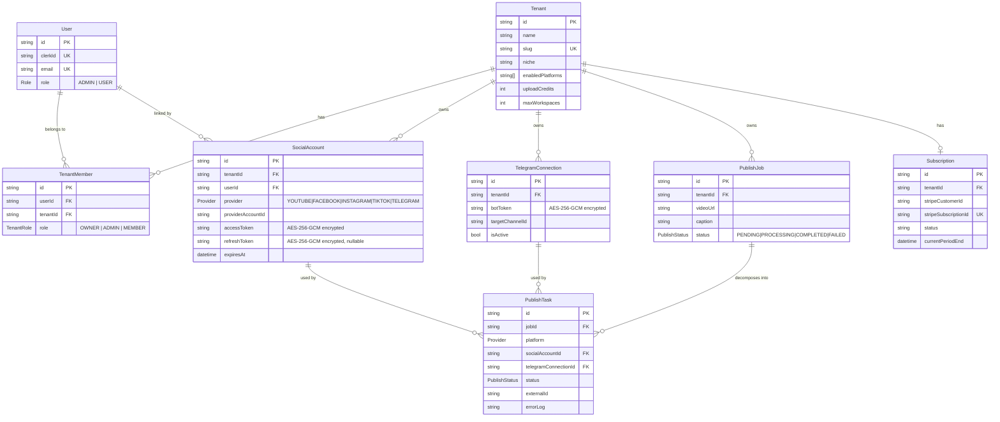

# CastBot — System Architecture

## 1. Monorepo Structure & Dependency Flow

CastBot is an npm-workspaces monorepo with two deployable applications and one shared library package.

```
castbot-monorepo (root package.json, workspaces: apps/*, packages/*)
│
├── packages/database  ("@repo/database")
│     Owns: prisma/schema.prisma, generated Prisma Client, PrismaPg pool adapter,
│            withPrismaRetry() resilience wrapper, ensurePrismaConnected()
│     Consumed by: apps/backend (primary), apps/frontend (direct reads in a few routes)
│
├── apps/backend  ("backend")
│     Express API + BullMQ workers + platform publisher adapters.
│     Depends on: @repo/database
│
└── apps/frontend  ("frontend")
      Next.js App Router dashboard (Clerk-authenticated UI).
      Depends on: @repo/database (schema types), talks to apps/backend over HTTP.
```

**Execution lifecycle:**

1. `npm install` at the root resolves all three workspaces together; `postinstall` runs `db:generate`, generating the Prisma Client that both apps import.
2. `apps/backend`'s `src/index.ts` is the single Express process entry point. Importing `./workers/publish.worker` at the top of that file has the side effect of starting both BullMQ `Worker` instances **in the same Node process** as the HTTP server — there is no separate worker deployment target.
3. `apps/frontend` is a standard Next.js app; it never talks to Postgres or Redis directly for publishing — all mutating operations go through the backend's REST API via `src/lib/api-client.ts`.

---

## 2. End-to-End Publishing Pipeline (Manual Upload)



### Queue topology

CastBot deliberately runs **two isolated BullMQ queues** on the same Redis connection:

| Queue | Name | Concurrency | Platforms |
|---|---|---|---|
| Light queue | `publish-video-queue` | 5 | YouTube, Facebook, Instagram, Telegram (fast, API-based) |
| TikTok queue | `publish-video-tiktok-queue` | 2 | TikTok (slow, Puppeteer/stealth-browser-based) |

A single publish request that targets both TikTok and a light platform enqueues **two BullMQ jobs sharing the same `jobId`** — one per queue — so the heavy Puppeteer session never blocks or starves API-based publishers, and vice versa. Because the parent `PublishJob` and shared temp video/config files are only cleaned up once every `PublishTask` child (across both queues) has reached a terminal state, `finalizeIfReady()` coordinates which queue is responsible for the final status write and file cleanup.

Both queues share `defaultJobOptions`: 3 attempts with exponential backoff (5s base), completed jobs retained 24h/500 max, failed jobs retained 7 days — giving operators a forensic window on failures without unbounded Redis growth.

### Delayed / scheduled publishing

`scheduledForRaw` on the publish request is converted to a millisecond `delay` and passed straight into BullMQ's native `add(name, data, { delay })` option — there is no separate cron or polling scheduler. BullMQ's own delayed-job mechanism holds the job until the target time, then moves it into the active queue exactly as an immediate job would be.

---

## 3. Reverse Auto-Publish Flow (Telegram Inbound)

This is the "drop a video into a Telegram channel and it republishes everywhere" flow.

```mermaid
sequenceDiagram
    participant TG as Telegram Servers
    participant API as Express API (/api/telegram/webhook)
    participant SVC as telegram.service.ts
    participant DB as PostgreSQL
    participant Q as BullMQ
    participant W as publish.worker.ts

    TG->>API: POST /api/telegram/webhook (video message update)
    Note over API: Route is intentionally public — Telegram itself calls it.<br/>No bearer auth; identity is derived from the payload.
    API->>SVC: ingestTelegramWebhookUpdate(update, tenantIdParam?)
    SVC->>SVC: Extract video/document file_id + caption + chat.id
    SVC->>DB: Look up TelegramConnection by targetChannelId (or ?tenantId= fallback)
    alt No matching, active TelegramConnection
        SVC-->>API: { status: "unauthorized" } (still HTTP 200 to Telegram)
    else Matched to a Tenant
        SVC->>TG: getFile(file_id) -> resolve CDN file_path
        SVC->>TG: Download the video stream to local scratch dir
        SVC->>DB: createPendingPublishJob() targeting all of the tenant's default platforms
        SVC->>Q: Enqueue to publishQueue / tiktokPublishQueue exactly as the manual flow does
        SVC-->>API: { status: "queued", jobId }
    end
    Q->>W: Same worker code path as manual publish takes over from here
```

Key properties of this path:

- **Bot registration** (`POST /api/telegram/register-bot`, authenticated + tenant-scoped) validates the bot token against Telegram's `getMe`, encrypts and upserts the `TelegramConnection` row, and auto-configures the bot's webhook URL to point back at `/api/telegram/webhook?tenantId=<tenantId>`.
- **Identity resolution without auth headers**: since Telegram calls the webhook directly, tenant identity is derived either by matching the inbound `chat.id` against a registered `TelegramConnection.targetChannelId`, or by the `?tenantId=` query param baked into the webhook URL at registration time. Unmatched chat IDs are rejected as `unauthorized`.
- **Always HTTP 200**: the handler never throws back to Telegram's servers — failures are communicated via the `status` field internally and logged, since a non-200 response would cause Telegram to keep retrying the same update indefinitely.
- Once ingested, the reverse flow **converges onto the exact same BullMQ queues and worker code** used by the manual dashboard upload — there is no separate "auto-pilot worker."

---

## 4. Database ERD



**Design notes drawn directly from `packages/database/prisma/schema.prisma`:**

- **`Tenant`** is the multi-tenancy root. Every scoped resource (`SocialAccount`, `TelegramConnection`, `PublishJob`, `Subscription`) carries a `tenantId` foreign key with `onDelete: Cascade`, and `Tenant.slug` is the human-readable workspace identifier used in URLs/config.
- **`User` ↔ `Tenant`** is many-to-many through `TenantMember`, which also carries the per-tenant `TenantRole` (`OWNER` / `ADMIN` / `MEMBER`) — a user can belong to multiple workspaces with different roles in each.
- **`SocialAccount`** is unique per `(tenantId, provider, providerAccountId)`, allowing a tenant to hold at most one connection per concrete external account per provider, while still supporting multiple providers side by side.
- **`PublishJob` → `PublishTask`** is the parent/child status ledger: the `PublishJob` row tracks the overall request (one video, one or more target platforms), while each `PublishTask` row independently tracks a single platform's attempt — including its own `status`, `externalId` (e.g. the resulting YouTube video ID), and `errorLog`. This is what allows partial success (e.g. YouTube succeeds, TikTok fails) to be represented and surfaced in the dashboard's job inspector.
- **`Subscription`** is a 1:1 extension of `Tenant`, mirroring Stripe's customer/subscription/price identifiers plus the current billing period end, used to gate `uploadCredits` and `maxWorkspaces` by plan tier.
