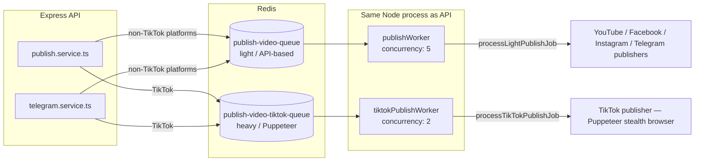

# CastBot Backend — Architecture

## 1. Service Layer Breakdown

```
src/
├── routes/         # Express routers — wiring only, no business logic
├── controllers/     # Thin request/response adapters (asyncHandler + sendSuccess)
├── services/         # Business logic, orchestration, external API calls
├── publishers/        # One class per platform: encapsulates that platform's upload mechanics
├── queues/             # BullMQ Queue definitions + job payload typing
├── workers/            # BullMQ Worker processors — the actual job execution logic
├── lib/                  # Cross-cutting infrastructure: prisma client, db-ledger, cloudinary
├── middlewares/            # authMiddleware, tenant.middleware, credit.middleware, cors, rate-limit, error handler
├── utils/                    # crypto.util (AES-256-GCM), async-handler, response envelope helpers
├── errors/                     # Typed AppError hierarchy
└── config/                       # Redis / Clerk / Stripe client initialization
```

**Request-time flow** (`routes` → `controllers` → `services`) vs. **background flow** (`queues` → `workers` → `publishers`) are cleanly separated: a controller's job is only to validate/marshal input and enqueue or persist; a worker's job is to actually execute a platform publish. This means the HTTP request for `POST /api/publish` returns almost immediately (job accepted/queued) regardless of how long the underlying TikTok Puppeteer session or YouTube upload takes.

### `publish.service.ts` — manual publish orchestration

`publishVideo()`:
1. Validates the uploaded file and requested platforms exist.
2. Resolves the tenant's `slug` (fails fast with `NotFoundError` if the tenant no longer exists).
3. Computes a BullMQ `delay` from an optional `scheduledFor` timestamp, enforcing a minimum 1-minute-in-the-future guard.
4. Calls `createPendingPublishJob()` (see `lib/db-ledger.ts`) to write the parent `PublishJob` **and** pre-create one `PublishTask` row per requested platform, resolving each task's target `SocialAccount`/`TelegramConnection` up front.
5. Persists the raw video buffer and a JSON job-config file to a local scratch directory (`src/scripts/temp-<jobId>.mp4` / `config-<jobId>.json`) — this is the payload workers read back from disk rather than carrying the full video buffer through Redis.
6. Enqueues into `publishQueue` and/or `tiktokPublishQueue` depending on which platforms were requested, using the **same `jobId`** as the BullMQ job ID on both queues (idempotency + easy cross-referencing).
7. Decrements `tenant.uploadCredits` by 1 — **after** successful enqueue, so a Redis outage doesn't silently burn a tenant's credit for a job that was never queued.

### `telegram.service.ts` — bot registration + bidirectional dispatch

- `registerTelegramBot()` — validates the token via Telegram's `getMe`, encrypts and `upsert`s the `TelegramConnection`, and calls Telegram's `setWebhook` pointing back at `/api/telegram/webhook?tenantId=<id>`.
- `ingestTelegramWebhookUpdate()` — the reverse-flow entry point described in the root `ARCHITECTURE.md`; resolves tenant identity from the inbound chat, downloads the video from Telegram's CDN, and enqueues it through the exact same `publish.queue.ts` queues the manual flow uses.
- `sendVideoToTelegramChannel()` — used when `TELEGRAM` is itself one of the requested *output* platforms on a manual publish; streams the local video file to Telegram's Bot API `sendVideo` endpoint via `form-data`.

### `publishers/*.publisher.ts` — one adapter per platform

| Publisher | Mechanism |
|---|---|
| `youtube.publisher.ts` | `googleapis` YouTube Data API v3, OAuth2 refresh-token flow |
| `facebook.publisher.ts` | Graph API Reels publishing against a Page access token |
| `instagram.publisher.ts` | Graph API Reels publishing against an Instagram Business Account, requires a Cloudinary-hosted `secure_url` (Instagram's API needs a publicly fetchable video URL, not a raw upload) |
| `tiktok.publisher.ts` | **No public upload API used** — drives TikTok's web creator studio via `puppeteer-extra` + `puppeteer-extra-plugin-stealth`, replaying cookies parsed from either a JSON cookie-jar export or a raw `Cookie:` header string (`parseTikTokCookies()`) |

`publisher.factory.ts` centralizes provider → publisher-class dispatch (`getPublisher(provider, credentials)`), replacing what would otherwise be repeated `if (provider === "TIKTOK")`-style branching at every call site.

---

## 2. Background Job Queue Design



**Why two queues instead of one:** TikTok publishing launches a real, stealth-patched Chromium instance and drives the TikTok web UI — this is slow (many seconds to minutes) and resource-heavy per job. Running it on the same queue/concurrency budget as the fast, purely-HTTP YouTube/Facebook/Instagram/Telegram publishers would let a handful of TikTok jobs starve the concurrency slots those fast publishers rely on to stay responsive. Splitting into `publish-video-queue` (concurrency 5) and `publish-video-tiktok-queue` (concurrency 2) isolates that resource contention.

**Concurrency locking / cross-queue coordination:** a single publish request that spans both TikTok and a light platform produces two independent BullMQ jobs — one per queue — sharing one `jobId` and one parent `PublishJob` row. Each worker branch only knows about its own platforms. `finalizeIfReady()` in `publish.worker.ts` decides who gets to write the final overall `PublishJob` status and delete the shared temp video/config files:

- If a job never spanned both queues, the single branch that processed it finalizes immediately.
- If it did span both queues, each branch calls `getJobTaskCompletionState(jobId)` after finishing its own share of platforms; only once **every** `PublishTask` child (across both branches) is in a terminal state (`COMPLETED`/`FAILED`) does the job's overall status get written and its temp files cleaned up — preventing one queue's worker from deleting a video file the sibling queue's worker still needs mid-flight.

**Job options** (shared by both queues, `queues/publish.queue.ts`):
- `attempts: 3` with `exponential` backoff (5000ms base)
- `removeOnComplete`: kept 24h / max 500 entries
- `removeOnFail`: kept 7 days

**Scheduling:** delayed publishes use BullMQ's native `delay` job option computed from `scheduledFor - now()` — there is no separate cron scheduler; Redis/BullMQ itself holds the job until due.

---

## 3. Token Encryption & Security Layer

All long-lived secrets persisted to Postgres — OAuth access/refresh tokens (`SocialAccount`), TikTok session cookies (stored in the same `accessToken`/`refreshToken` columns), and Telegram bot tokens (`TelegramConnection.botToken`) — are encrypted at rest with **AES-256-GCM** (`src/utils/crypto.util.ts`):

- `getEncryptionKey()` derives a 256-bit key via `SHA-256` of the `ENCRYPTION_KEY` environment secret (falling back to a hardcoded development default if unset — **must** be overridden in any real deployment).
- `encryptToken(text)` generates a random 16-byte IV per call, encrypts with `aes-256-gcm`, and serializes the result as `iv:authTag:ciphertext` (all hex-encoded).
- `decryptToken(payload)` parses that three-part format, verifies the GCM auth tag (which fails closed on any tampering), and returns the plaintext. It defensively treats any string that doesn't look like the `iv:authTag:ciphertext` shape (wrong segment count or lengths) as already-plaintext and returns it unchanged — this backward-compatibility path lets legacy/unencrypted or mock values continue to work without a hard migration.
- At worker-execution time, `safeDecryptToken()` in `publish.worker.ts` wraps `decryptToken()` in an additional try/catch, falling back to the raw string on any decryption error rather than failing the entire publish job outright — favoring a clear per-platform auth failure over a hard worker crash.

**OAuth `state` integrity** (separate from token-at-rest encryption): the YouTube/Meta OAuth flows sign their `state` parameter with `HMAC-SHA256` (`generateSignedState` / `verifyAndDecodeState` in `auth.controller.ts`), using `crypto.timingSafeEqual` for the signature comparison to avoid timing side-channel attacks, and reject any state whose signature doesn't match before trusting the embedded `userId`/`tenantId`.

**Tenant isolation:** `validateTenantMiddleware` resolves and authorizes the `x-tenant-id` header against the requesting user's actual `TenantMember` rows (via `tenant.service.ts`) on every scoped route, with a 5-second `Promise.race` timeout guard against database pool congestion — no route trusts a client-supplied tenant ID without that membership check.

---

## 4. Failure Resilience & Retry Mechanisms

### Database layer — `withPrismaRetry()`

`packages/database/src/client.ts` exports a resilient query wrapper used throughout the backend (`prisma.ts` re-exports it) that:

1. Executes the wrapped Prisma call.
2. On failure, checks the error message against a list of known transient-connection signatures (`P1017`, `"Server has closed the connection"`, `ConnectionClosed`, `"Connection terminated"`, connection-timeout variants, `"terminating connection due to administrator command"` — the latter is characteristic of managed Postgres providers recycling idle connections).
3. If transient and retries remain (default 2), calls `prisma.$connect()` to re-establish the connection, waits an increasing backoff (`600ms * attempt`), and retries.
4. Any non-transient error, or exhausted retries, propagates immediately rather than being swallowed.

The underlying `PrismaClient` itself is constructed with a custom `PrismaPg` driver adapter over a `pg.Pool` (max 15 connections, 30s idle timeout, keep-alive enabled) rather than Prisma's default connection handling, giving finer control over pool behavior against cloud/managed Postgres.

### Queue/worker layer — the status ledger never sticks

The worker code treats **"never leave a `PublishJob` or `PublishTask` stuck in `PENDING`/`PROCESSING`"** as an invariant, enforced at multiple layers:

- Every per-platform publish attempt inside `processLightPublishJob` / `processTikTokPublishJob` is wrapped so that a caught error immediately calls `safeUpsertTask(..., PublishStatus.FAILED, ...)` for that specific platform before moving on to the next one — one platform failing never aborts the others.
- If the branch throws before even reaching per-platform logic (e.g. Cloudinary unreachable), the outer `catch` marks the entire `PublishJob` `FAILED` directly via `updatePublishJobStatus()`.
- As a last-resort safety net, `publishWorker.on("failed", ...)` and `tiktokPublishWorker.on("failed", ...)` listeners check `job.attemptsMade >= job.opts.attempts` — once BullMQ's own retry budget (3 attempts) is exhausted, they force-write `FAILED` and clean up temp artifacts even if the in-process catch block inside the processor never got a chance to run (e.g. the process was killed mid-job).
- `cleanupJobArtifacts()` is idempotent and best-effort (checks `fs.existsSync` before unlinking, swallows and logs any unlink error) so it's always safe to call from multiple code paths without risk of an unhandled crash from a double-delete or already-missing file.

### Ledger design — `lib/db-ledger.ts`

- `createPendingPublishJob()` resolves the tenant's actual `SocialAccount`/`TelegramConnection` rows at job-creation time and pre-creates one `PENDING` `PublishTask` per target platform (expanding the pseudo-platform `META` into concrete `FACEBOOK`/`INSTAGRAM` tasks based on which accounts actually exist) — this satisfies a Postgres-level invariant that every task have exactly one resolvable target, and gives the frontend immediate visibility into "what will happen" before any worker has even picked the job up.
- `upsertPublishTask()` is idempotent per `(jobId, platform)`, so a worker can safely call it multiple times across a job's lifecycle (`PENDING` → `PROCESSING` → `COMPLETED`/`FAILED`) without needing to track whether the row already exists.
- `getJobTaskCompletionState()` is the primitive the cross-queue `finalizeIfReady()` coordination logic (see §2) is built on.
