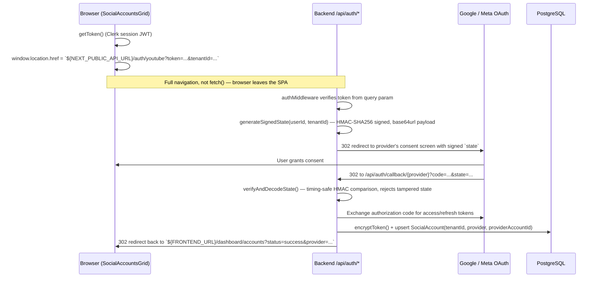
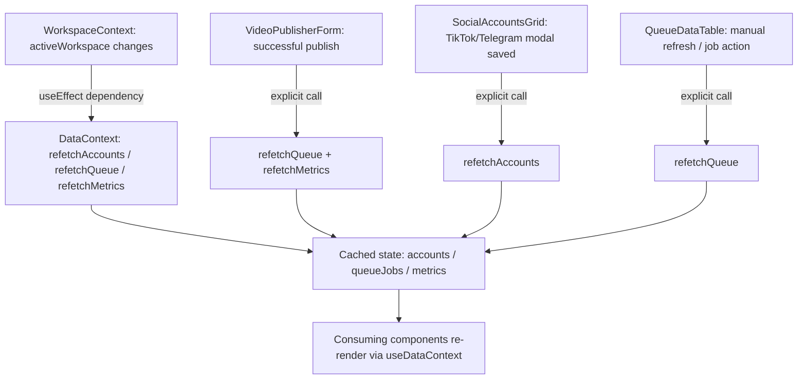

# CastBot Frontend — Architecture

## 1. API Client Layer & Dynamic Base URL Resolution

All backend communication is funneled through a single module, `src/lib/api-client.ts`, rather than being scattered across components as raw `fetch()` calls.

```ts
export const API_BASE_URL =
  process.env.NEXT_PUBLIC_API_URL ||
  process.env.NEXT_PUBLIC_BACKEND_URL ||
  "http://localhost:5000/api";
```

Resolution order: an explicit `NEXT_PUBLIC_API_URL` wins first, then a legacy `NEXT_PUBLIC_BACKEND_URL` fallback, then a hardcoded local-dev default that already includes the `/api` prefix. This lets the same built frontend bundle be pointed at any backend deployment purely through environment configuration, with no code changes.

`fetchFromApi(endpoint, options, token)`:

1. Normalizes `endpoint` to always start with `/`, strips trailing slashes off the base, and concatenates them (or passes through untouched if `endpoint` is already an absolute URL).
2. Attaches `Authorization: Bearer <token>` when a Clerk session token is supplied.
3. **Single source of truth for tenant scoping**: on every call, it reads `castbot_active_workspace_id` out of `localStorage` and — if present — force-sets the `x-tenant-id` header itself, explicitly overriding anything a caller might have set, to avoid races between a stale header set at a call site and the actual active workspace.
4. Defaults `Content-Type: application/json` only when the body is a plain string (so `FormData` uploads, like video publishing, are left alone to set their own multipart boundary).
5. Wraps the underlying `fetch()` in a try/catch that rethrows a descriptive connectivity error naming the resolved URL, aiding local-dev debugging when the Express backend isn't running.

`unwrapApiEnvelope<T>(json)` is a small helper used by call sites to transparently unwrap the backend's common `{ success, data }` response envelope, falling back to the raw payload for endpoints that don't use it — avoiding repeated `response.data ?? response` checks throughout the component tree.

---

## 2. OAuth Dynamic Redirect Flow

YouTube and Meta (Facebook/Instagram) connections are **not** initiated via a Next.js API route — the frontend redirects the full browser window straight at the backend's OAuth-initiation endpoints, which is what lets the backend own the entire OAuth `state`-signing and provider-redirect logic in one place.



Why this shape:

- `authMiddleware` normally expects a `Bearer` header, but since this is a full-page redirect (no custom headers possible), `auth.middleware.ts` also accepts the token via `?token=` query param — the same verification path (`verifyToken` from `@clerk/backend`) is used either way.
- The `state` parameter is not a random anti-CSRF nonce alone — it's an HMAC-SHA256-signed payload embedding both the initiating `userId` and the `tenantId` the user was actively working in, so the callback can restore exactly which workspace the new `SocialAccount` should be attached to, independent of whatever workspace happens to be active by the time the OAuth round-trip completes.
- TikTok has no such flow: since there's no public OAuth surface for the automation approach CastBot uses, `SocialAccountsGrid` instead opens a `TikTokCookieModal` for the user to paste exported session cookies, which are submitted as a normal authenticated JSON POST (not a redirect) and encrypted the same way as other provider tokens.

---

## 3. Component Reactivity & Cache Invalidation Model

CastBot intentionally avoids a heavyweight data-fetching library (no React Query / SWR); it uses a small hand-rolled cache in `DataContext` instead.



There is **no timer-based polling** — every refetch is triggered either by the active workspace changing (handled once, centrally, inside `DataContext`'s own `useEffect`) or by a specific mutating user action explicitly calling the relevant `refetchX()` afterward (e.g. `VideoPublisherForm` calls `refetchQueue()`/`refetchMetrics()` right after a successful `/api/publish` response). This keeps network usage predictable — the tradeoff is that a long-running background job's status change (e.g. a worker finishing a TikTok upload) will not appear in `QueueDataTable` until the user triggers a refetch, navigates back to the queue view, or otherwise re-triggers one of the explicit invalidation paths above.

Each cached slice fails soft: a failed `refetchX()` call swallows the error and leaves the previous cached value in place rather than clearing the UI, so a transient backend hiccup doesn't blank out the dashboard.

---

## 4. State Synchronization Summary

| Concern | Mechanism |
|---|---|
| Auth session | Clerk (`useAuth()`), verified independently by the backend on every request |
| Active tenant/workspace | `WorkspaceContext` + `localStorage` (`castbot_active_workspace_id`), injected into every API call via `fetchFromApi` |
| Server-state cache | `DataContext` (accounts / queueJobs / metrics), invalidated on workspace change or explicit post-mutation calls |
| Form state | `react-hook-form` + `zod` schemas (e.g. `publisherFormSchema` in `VideoPublisherForm`) |
| Theme | `next-themes` via `ThemeProvider`, `class` attribute strategy, system-theme aware |
