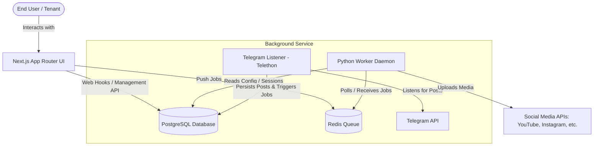
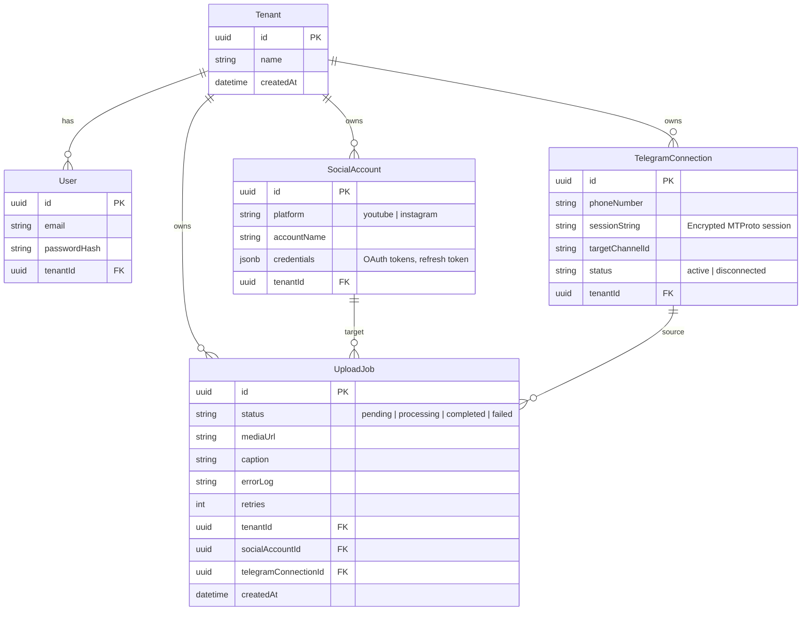

# System Architecture: Multi-Tenant Telegram-to-Social-Media SaaS

This document outlines the architectural design, database schema, and module integration for the multi-tenant SaaS application.

---

## 1. UI & Worker Separation

To achieve scalability, responsiveness, and reliable operations, the application is divided into two distinct components: the **Next.js UI (Web Portal)** and the **Background Worker Service**.



### Next.js UI (Web Portal)
- **Tech Stack**: Next.js (App Router), React, Tailwind CSS, TypeScript.
- **Role**:
  - Front-end portal for tenant onboarding, settings management, and dashboard visualization.
  - Authentication (e.g., Auth.js / NextAuth) and role-based access control.
  - OAuth flows to link external social media accounts (Google/YouTube, Facebook/Instagram).
  - Writing configuration (target channels, upload rules) directly to the PostgreSQL database.
  - Monitoring upload jobs and queue statuses.

### Background Worker Service
- **Tech Stack**: Python (Telethon, Celery/RQ, Prisma Client Python / SQLAlchemy).
- **Role**:
  - **Telegram Event Listener**: Runs persistent, stateful MTProto client sessions to listen for new messages in target channels. Next.js serverless functions cannot maintain these long-lived connections.
  - **Upload Worker**: Pulls tasks from the queue (Redis/Celery or DB-poll) and uploads media. Media uploads can be large and time-consuming, which would exceed serverless timeout limits.
  - **Session Management**: Automatically logs in and keeps Telegram client sessions active, storing session strings securely in the database.

---

## 2. Modular Architecture & Service Adapter Pattern

The publisher module utilizes the **Service Adapter Pattern** to decouple the orchestration logic from platform-specific API implementations. This makes it trivial to add support for new platforms (e.g., TikTok, X/Twitter) without modifying the main workflow code.

```
src/publisher/
├── base.py                 # Abstract Base Class (Interface)
├── youtube_adapter.py      # YouTube Upload Adapter
├── instagram_adapter.py    # Instagram Upload Adapter
└── factory.py              # Dynamic adapter loader based on platform type
```

### Abstract Adapter Interface (`base.py`)
```python
from abc import ABC, abstractmethod
from typing import Dict, Any

class BasePublisherAdapter(ABC):
    @abstractmethod
    def authenticate(self, credentials: Dict[str, Any]) -> bool:
        """Verify credentials and refresh tokens if necessary."""
        pass

    @abstractmethod
    def publish(self, media_path: str, caption: str, settings: Dict[str, Any]) -> Dict[str, Any]:
        """Publish the media file to the platform and return the post details."""
        pass
```

---

## 3. Database Schema (Multi-Tenant)

We use a PostgreSQL database. Below is the relational schema using Prisma-like notation.



### SQL Schema Definition

```sql
-- Tenants Table (Multi-tenancy isolation)
CREATE TABLE tenants (
    id UUID PRIMARY KEY DEFAULT gen_random_uuid(),
    name VARCHAR(255) NOT NULL,
    created_at TIMESTAMP WITH TIME ZONE DEFAULT CURRENT_TIMESTAMP,
    updated_at TIMESTAMP WITH TIME ZONE DEFAULT CURRENT_TIMESTAMP
);

-- Users Table
CREATE TABLE users (
    id UUID PRIMARY KEY DEFAULT gen_random_uuid(),
    tenant_id UUID NOT NULL REFERENCES tenants(id) ON DELETE CASCADE,
    email VARCHAR(255) UNIQUE NOT NULL,
    password_hash VARCHAR(255) NOT NULL,
    name VARCHAR(255),
    created_at TIMESTAMP WITH TIME ZONE DEFAULT CURRENT_TIMESTAMP,
    updated_at TIMESTAMP WITH TIME ZONE DEFAULT CURRENT_TIMESTAMP
);

-- Social Accounts Table (OAuth credentials for destinations)
CREATE TABLE social_accounts (
    id UUID PRIMARY KEY DEFAULT gen_random_uuid(),
    tenant_id UUID NOT NULL REFERENCES tenants(id) ON DELETE CASCADE,
    platform VARCHAR(50) NOT NULL, -- e.g., 'youtube', 'instagram'
    account_name VARCHAR(255) NOT NULL,
    credentials JSONB NOT NULL, -- Access, refresh tokens, scopes, expiry
    created_at TIMESTAMP WITH TIME ZONE DEFAULT CURRENT_TIMESTAMP,
    updated_at TIMESTAMP WITH TIME ZONE DEFAULT CURRENT_TIMESTAMP
);

-- Telegram Connections Table (Listeners configurations)
CREATE TABLE telegram_connections (
    id UUID PRIMARY KEY DEFAULT gen_random_uuid(),
    tenant_id UUID NOT NULL REFERENCES tenants(id) ON DELETE CASCADE,
    phone_number VARCHAR(50),
    session_string TEXT, -- Encrypted MTProto session for Telethon/Pyrogram
    target_channel_id VARCHAR(255) NOT NULL,
    status VARCHAR(50) DEFAULT 'inactive', -- 'active', 'inactive', 'error'
    created_at TIMESTAMP WITH TIME ZONE DEFAULT CURRENT_TIMESTAMP,
    updated_at TIMESTAMP WITH TIME ZONE DEFAULT CURRENT_TIMESTAMP
);

-- Upload Jobs Table (Work Queue & Status tracking)
CREATE TABLE upload_jobs (
    id UUID PRIMARY KEY DEFAULT gen_random_uuid(),
    tenant_id UUID NOT NULL REFERENCES tenants(id) ON DELETE CASCADE,
    telegram_connection_id UUID REFERENCES telegram_connections(id) ON DELETE SET NULL,
    social_account_id UUID REFERENCES social_accounts(id) ON DELETE SET NULL,
    status VARCHAR(50) DEFAULT 'pending', -- 'pending', 'processing', 'completed', 'failed'
    media_url TEXT,
    caption TEXT,
    error_log TEXT,
    retries INT DEFAULT 0,
    created_at TIMESTAMP WITH TIME ZONE DEFAULT CURRENT_TIMESTAMP,
    updated_at TIMESTAMP WITH TIME ZONE DEFAULT CURRENT_TIMESTAMP
);

-- Create indexes for performance and tenant scoping
CREATE INDEX idx_users_tenant ON users(tenant_id);
CREATE INDEX idx_social_accounts_tenant ON social_accounts(tenant_id);
CREATE INDEX idx_telegram_connections_tenant ON telegram_connections(tenant_id);
CREATE INDEX idx_upload_jobs_tenant ON upload_jobs(tenant_id);
CREATE INDEX idx_upload_jobs_status ON upload_jobs(status);
```

---

## 4. UI Design Philosophy (Tailwind & Mobile-First)

The portal dashboard needs to be fully responsive for users managing uploads from mobile devices.

- **Responsive Grid**: Flexbox and CSS Grids with breakpoints (`sm:`, `md:`, `lg:`) to scale from small phones to wide monitors.
- **Glassmorphism Sidebar & Navigation**: Smooth navigation drawer that collapses into a bottom bar or overlay on mobile viewports.
- **Theme Support**: Centralized color variables leveraging CSS custom properties mapped to a Tailwind configuration for smooth light/dark mode transitions.
